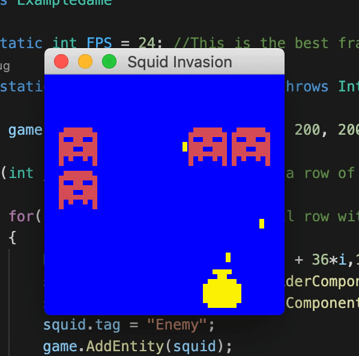

# WELCOME TO JGE (Jet's-Java Game Engine)! 👋 

> JGE is a bare-bones Java Game Engine built off of JSwing made by me (Jet Simon) to learn more about Java and OOP.

So far it supports:

* Sprites 👨🏽‍🎨
* Keyboard and Mouse Input ⌨️
* Collisions 💥
* Add your own custom components to objects with our premium *Entity-Component* system! 😳
* Or use our built in components, including the mysterious **PhysicsComponent**! 🕵🏾‍♂️

👾 *the example game that comes with the package*

---

## TODO 📝

- [X] ~~Change collision from a boolean system -> pooling system~~
- [ ] Add SFX/music support
- [ ] Add background, main, and foreground layering system
- [ ] Add PhysicsComponent
- [X] ~~Add image support for sprites~~
- [ ] Change collision boxes to collision component system for more flexible use.
- [X] ~~Create a fun little example game to show off our amazing features!~~
- [ ] Add a scene system. Scene class? Contains layers that contain entities? This is making a lot of sense!
- [ ] Once scene system is added in, make it so you can actually win and lose the example game!
- [ ] Add rotation to sprites
- [ ] Add some sort of "prefab" system like Unity?